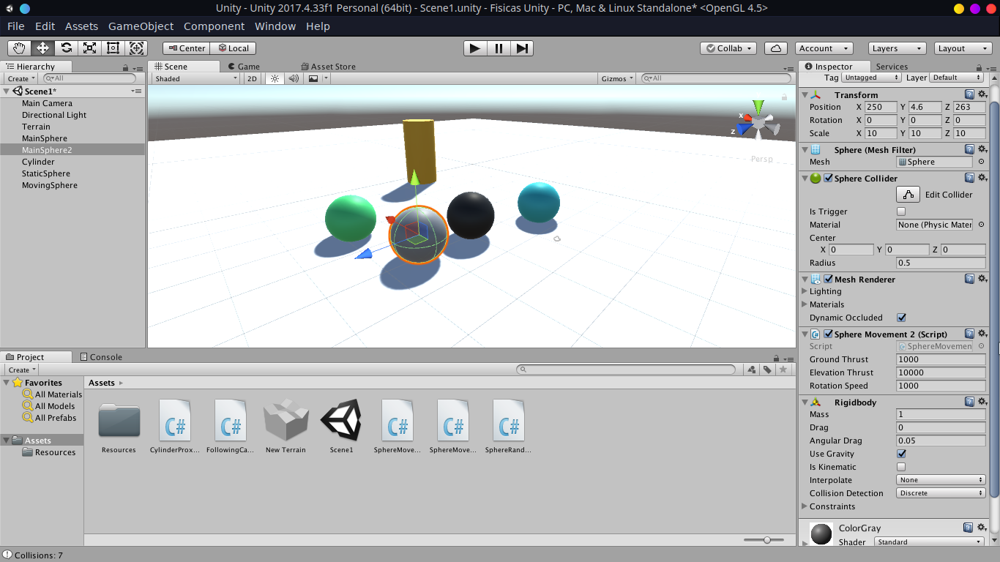
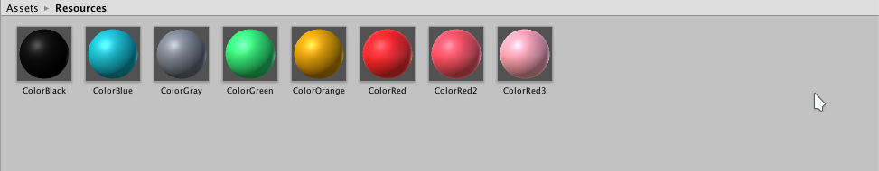

# Físicas en Unity

## Apariencia de la escena



Los elementos de la escena son, referidos según su nombre y color:

* **MainSphere** : La esfera principal, se mueve utilizando { W, A, S, D }  y cuenta las colisiones. 
* **MainSphere2** : La esfera secundaria, se mueve utilizando { I, J, K, L }  y cuenta las colisiones.
* **StaticSphere** : Esfera estática cuyo único propósito en la escena es que colisionen con ella.
* **MovingSphere** : Esfera cuyo propósito al igual que la anterior es que colisionen con ella pero en este caso moviéndose aleatoriamente.
* **Cylinder** :  Cilindro que cambia de color según la proximidad de la esfera _MainSphere_.

## Cada vez que el objeto jugador colisione con una esfera se debe  incrementar un contador. Una de las escenas estará fija, la otra debe  estar rodando aleatoriamente por la escena.

### Script que implementa el movimiento del jugador y de las colisiones

```c#
using System.Collections;
using System.Collections.Generic;
using UnityEngine;

public class SphereMovement : MonoBehaviour
{
  private Rigidbody rb;         // Contiene la componente Rigidbody.
  private bool isGrounded;      // Indica si la esfera está tocando
                                // el suelo.
  public float groundThrust;    // Indica la fuerza a aplicar para
                                // el movimiento en los ejes X y Z.
  public float elevationThrust; // Indica la fuerza a aplicar para
                                // el movimiento en el eje Y.
	public float rotationSpeed;

  private int  collisionCounter; // Contador de colisiones.

	void Start () {
		  rb = gameObject.GetComponent<Rigidbody>();
	}
	
    private void OnCollisionEnter(Collision collision)
    {	
 		/* Si el objeto está tocando el suelo entonces
 		   le permitimos saltar */
        if(collision.gameObject.name == "Terrain")
        {
            isGrounded = true;
        }
        /* Si el objeto colisiona se suma una unidad al contador*/
        collisionCounter += 1;
        Debug.Log("Collisions: " + collisionCounter);
    }

    private void OnCollisionExit(Collision collision)
    {
        if (collision.gameObject.name == "Terrain")
        {
            isGrounded = false;
        }
        Debug.Log("Collisions: " + collisionCounter);
    }

    void Update () {
		if(Input.GetKey(KeyCode.W)){
			 rb.AddForce(new Vector3(1,0,1) * groundThrust * Time.deltaTime);
		}

		if(Input.GetKey(KeyCode.A)){
			rb.AddForce(new Vector3(-1,0,1) * groundThrust * Time.deltaTime);
		}

		if(Input.GetKey(KeyCode.D)){
			rb.AddForce(new Vector3(1,0,-1) * groundThrust * Time.deltaTime);
		}

		if(Input.GetKey(KeyCode.S)){
			rb.AddForce(new Vector3(-1,0,-1) * groundThrust * Time.deltaTime);
		}

        if(Input.GetKeyDown(KeyCode.Space)){
            if (isGrounded){
                rb.AddForce(Vector3.up * elevationThrust * Time.deltaTime);
            }
        }

        if (Input.GetKey(KeyCode.E)){
            rb.transform.Rotate(0,Time.deltaTime * rotationSpeed , 0, Space.Self);
        }

        if (Input.GetKey(KeyCode.R)){
            rb.transform.Rotate(0, (-1) * Time.deltaTime * rotationSpeed,  0 , Space.Self);
        }
    }
}
```

### Script que implementa el movimiento aleatorio de la esfera

```c#
using System.Collections;
using System.Collections.Generic;
using UnityEngine;

public class SphereRandomMovement : MonoBehaviour
{
  private Rigidbody rb;         // Contiene la componente Rigidbody.
	private int minSpeed = 400;		// Mínima velocidad de la esfera
	private int maxSpeed = 800;		// Máxima velocidad de la esfera

  public float groundThrust;    // Indica la fuerza a aplicar para
                                // el movimiento en los ejes X y Z.
	// Use this for initialization
	void Start () {
		  rb = gameObject.GetComponent<Rigidbody>();
	}


  void Update () {

			float randomSeedZ = Random.Range(0,10);
			float randomSeedX = Random.Range(0,10);

			if(randomSeedZ < 5){
				if(randomSeedX > 5){
					rb.AddForce(Vector3.forward * Random.Range(minSpeed,maxSpeed) 										* Time.deltaTime);
					rb.AddForce(Vector3.right * Random.Range(minSpeed,maxSpeed)											* Time.deltaTime);
				}else{
					rb.AddForce(Vector3.forward * Random.Range(minSpeed,maxSpeed)										* Time.deltaTime);
					rb.AddForce(Vector3.left * Random.Range(minSpeed,maxSpeed)											* Time.deltaTime);
				}
			}else{
				if(randomSeedX > 5){
					rb.AddForce(Vector3.back * Random.Range(minSpeed,maxSpeed)  										* Time.deltaTime);
					rb.AddForce(Vector3.right * Random.Range(minSpeed,maxSpeed)  										* Time.deltaTime);
				}else{
					rb.AddForce(Vector3.back * Random.Range(minSpeed,maxSpeed)  										* Time.deltaTime);
					rb.AddForce(Vector3.left * Random.Range(minSpeed,maxSpeed) * 										* Time.deltaTime);
				}
			}

	}
}
```

Simplemente se inicializan dos semillas aleatorias para el movimiento en el eje x y el eje z ( excluimos el movimiento vertical ) y en función del valor de semillas se mueve en distinta dirección.


## La esfera debe responder a la física. Se deben incluir cilindros que  actúen como sensores, de forma que cambian de color cuando el objeto  jugador o la esfera estén cerca. Se deben elegir tres tonos de  intensidad que se asignarán según el estado de la colisión para cada uno de ellos. Por ejemplo, Ethan 3 tonos de rojo según entre en colisión,  siga en colisión o salga de la colisión.

En primer lugar se crean tres materiales para cada uno de los tonos de rojo ( _**ColorRed**_, _**ColorRed2**_, _**ColorRed3**_ ) que se dispondran en una carpeta llamada _**resources**_.




El script simplemente carga estos materiales en la función _start_ y asigna al renderer dichos materiales dependiendo del estado del objeto con respecto al cilindro.

```c#
using System.Collections;
using System.Collections.Generic;
using UnityEngine;

public class CylinderProximity : MonoBehaviour {

	Material ColorRed1;
	Material ColorRed2;
	Material ColorRed3;

	private void OnCollisionEnter(Collision collision)
	{
		if (collision.gameObject.name == "MainSphere")
		{
			GetComponent<Renderer>().material = ColorRed2;
		}
	}

	private void OnCollisionExit(Collision collision)
	{
			if (collision.gameObject.name == "MainSphere")
			{
				GetComponent<Renderer>().material = ColorRed3;
			}
	}

	private void OnCollisionStay(Collision collision)
	{
			if (collision.gameObject.name == "MainSphere")
			{
				GetComponent<Renderer>().material = ColorRed1;
			}
	}

	// Use this for initialization
	void Start () {
		ColorRed1 = Resources.Load<Material>("ColorRed");
		ColorRed2 = Resources.Load<Material>("ColorRed2");
		ColorRed3 = Resources.Load<Material>("ColorRed3");
	}

	// Update is called once per frame
	void Update () {

	}
}
```

## Ubicar un tercer objeto que sea capaz de detectar colisiones y que se mueva con las teclas: I, L, J, M

El funcionamiento de este objeto ( **MainSphere2** ) es exactamente el mismo que el de **MainSphere** solo que las teclas de Input cambian.